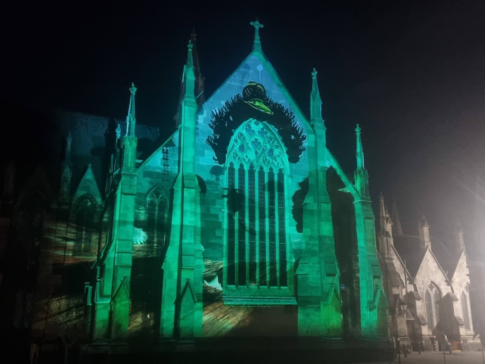

The Dunedin Midwinter Carnival's 2024 theme was "Creatures of the Deep" & in collaboration with [Dan Aston/Vision Chips](https://www.instagram.com/vision_chips/) I authored an undersea adventures worth of assets for projection on the heritage building, the First Church of Otago.

I leveraged vertex coloration heavily for the sea floor assets. Building for TouchDesigner I wanted to ensure as much data was bundled into the 3D files and available for quick programatic mixing.

### Anglerfish

### Asset coverage with morphs

In order to allow hundreds of fish to be instance as background objects I created a single fish mesh with greyscale texture. This mesh can be warped between blend shapes to create fish with different proportions and a greyscale image texture allows each model to be recolored with vertex colors or via shaders.

