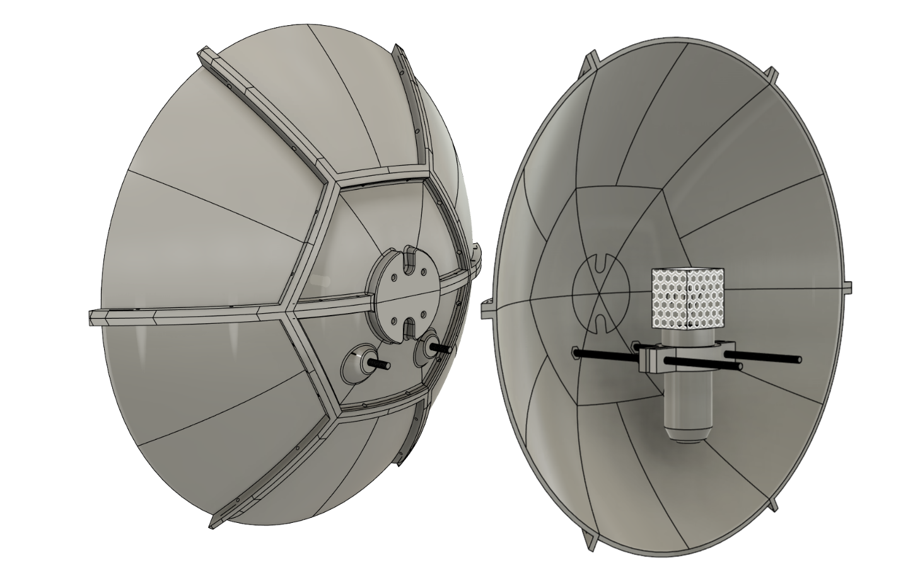
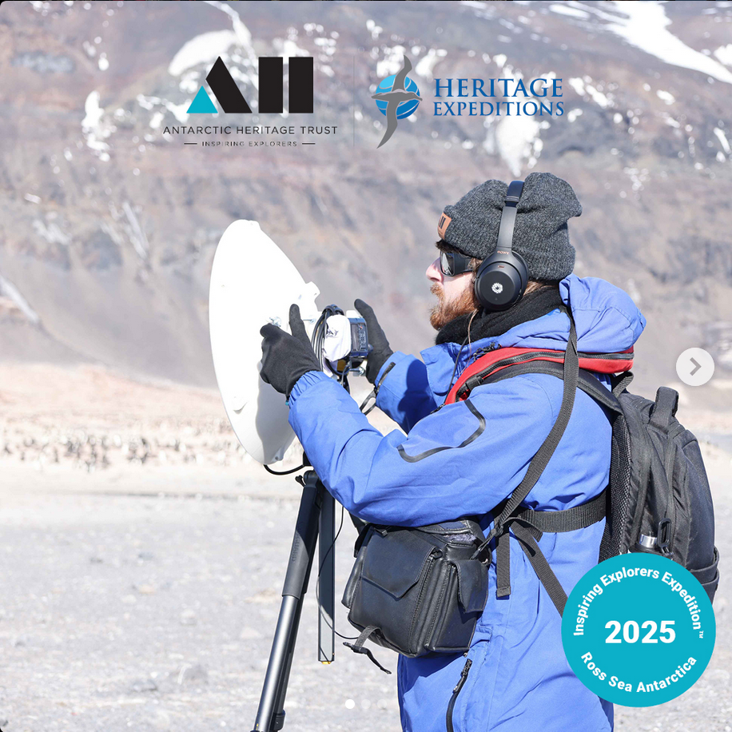
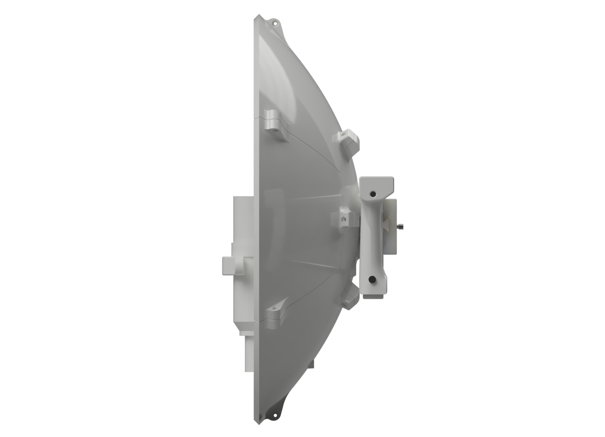
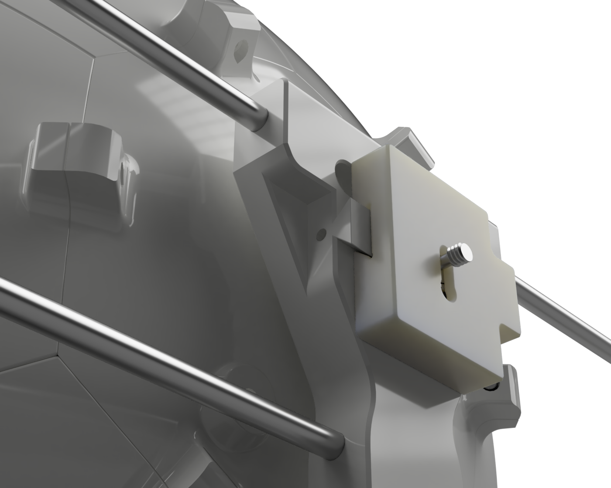
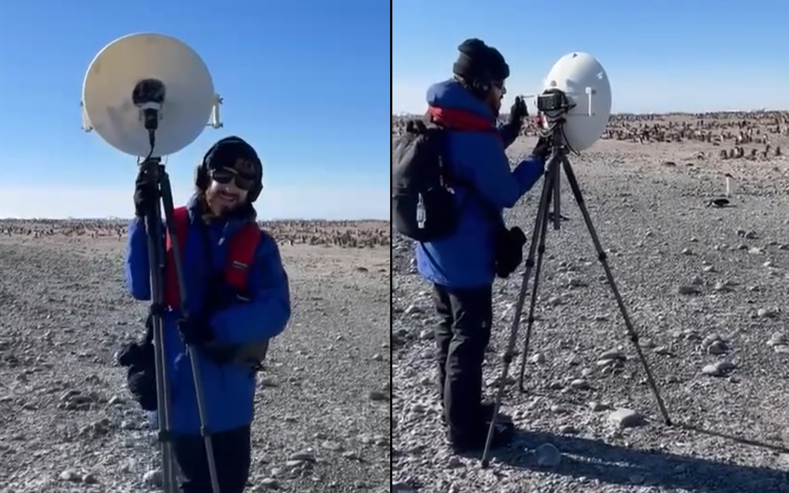

Parabolic microphones are used to collect and amplify sound at distance. In collaboration with Jed Prickett this 3D printed paraboloid was built to support Jed's ecological and musical pursuits.

In 2023 musician and microscope artist [Peregrin Hyde](https://www.perescope.co.nz/) brought our first prototype to South Georgia as part of an [Antarctica Heritage Trust](https://antarctic-heritage.recollect.co.nz/) expedition where he made recordings of wildlife and sea ice movements.

## V1, South Georgia

_Peregrin Hyde in South Georgia_

From Peregrin's expedition resulted in [Into Ocean & Ice](https://soundcloud.com/peregrinz/into-ocean-and-ice), a soundscape for the [New Zealand Maritime Museum](https://www.maritimemuseum.co.nz/exhibitions/into-ocean-and-ice?gad_source=1)'s exhibition of the same name, as well as [Watching the weather in the far southern seas](https://www.rnz.co.nz/national/programmes/ourchangingworld/audio/2018926815/watching-the-weather-in-the-far-southern-seas) , a podcast for Radio New Zealand's Our Changing world programme.

## V2, Antarctica

During 2024 we rebuilt our design from the ground up to solve key issues identified on Peregrin's expedition.
In 2025 Calum Turner brought our second model on an Antarctica expedition by the AHT, taking recordings in historic sites.

We reduced the number and type of fixtures needed to assemble the dish. Standardising all bolts at M3 for connections between pieces and M8 for structural elements. Heat-set inserts further simplified the bill of materials, made the assembly more resilient against nuts coming loose and importantly reduced the small part count in an environment where the temperatures require mittens.

  <!--  -->

Our original handle was made of wood and vertical which was compact and light. To meet biosecurity limitations on organics entering Antarctica and make handling the dish for extended periods more ergonomic we rebuilt our handle around 2 horizontal rods. This preserved modularity and packability and gave the operator greater control. The parabolic dish narrows the recording area to a fine point which can require fine motions to aim and adjust.

Antarctic winds made handling noise on the first model an issue. Our second model has a cutout to support the microphone cable and areas for velcro straps to tie down any excess cable length.

An adapter plate connects horizontal handle rods and a slide plate which holds the audio recorder's screen in clear view of the user. It joins to the dish via an anti-vibration rubber padding.

An Arca-Swiss style tripod mount on the base lets the operator use the dish without handles in a tripod.

_Images of the microphone in South Georgia and Antarctica taken by Kelsey Waghorn, Anna Clare and Rose Lasham._
